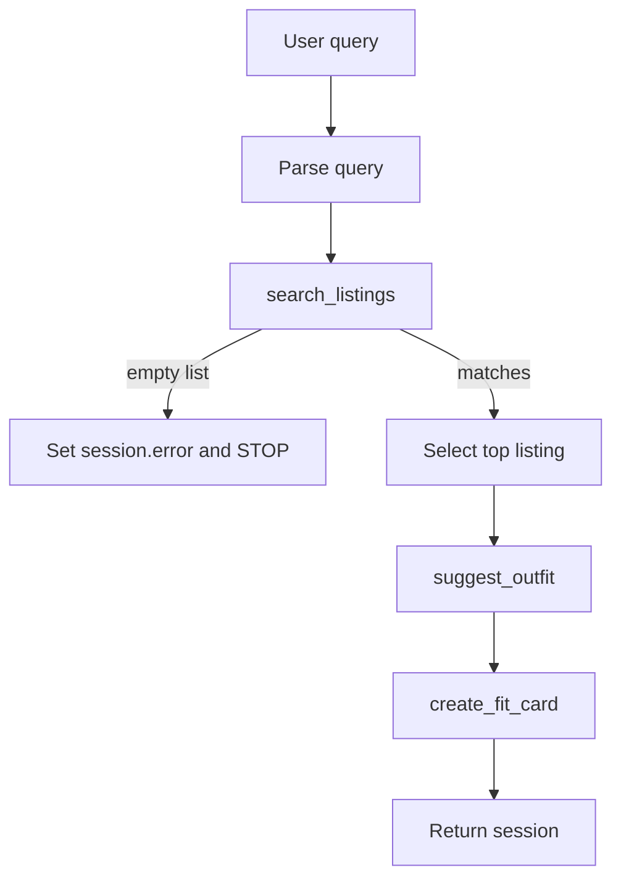

# FitFindr 🛍️

An agentic assistant for secondhand fashion. You describe what you're looking
for in plain language; FitFindr searches a mock marketplace, styles the best
find against your existing wardrobe, and writes a shareable caption for it.

FitFindr is built as a **three-tool planning loop**: the agent parses your
request, then decides — based on what each tool returns — whether to keep going
or stop early with a helpful message. It does **not** blindly run the same three
steps every time.

---

## Setup

```bash
pip install -r requirements.txt
```

Set your Groq API key in a `.env` file in the project root (free key at
[console.groq.com](https://console.groq.com)):

```
GROQ_API_KEY=your_key_here
```

## Run

```bash
python app.py          # Gradio UI — open the URL it prints (usually http://localhost:7860)
python agent.py        # CLI: runs a happy-path query and the no-results branch
python demo_failure_modes.py   # deliberately triggers all three failure modes
pytest -q              # 25 unit tests: core tools (incl. failure modes) + stretch features
```

The UI has three output panels — **Top listing found**, **Outfit idea**, and
**Your fit card** — plus a wardrobe toggle (example wardrobe vs. empty/new user)
and a row of example queries.

---

## Tool Inventory

The agent has three tools (in [`tools.py`](tools.py)). Two are LLM-backed (Groq,
`llama-3.3-70b-versatile`); the first is pure Python over the mock dataset.

### 1. `search_listings`
- **Purpose:** Find marketplace listings that match the user's request, ranked
  best-first by keyword relevance.
- **Inputs:**
  - `description: str` — keywords describing the item (e.g. `"vintage graphic tee"`)
  - `size: str | None` — optional size filter, matched case-insensitively as a substring (`"M"` matches `"S/M"`)
  - `max_price: float | None` — optional inclusive price ceiling
- **Output:** `list[dict]` — matching listing dicts (`id`, `title`, `description`,
  `category`, `style_tags`, `size`, `condition`, `price`, `colors`, `brand`,
  `platform`), sorted by relevance score. Empty list if nothing matches.

### 2. `suggest_outfit`
- **Purpose:** Style the chosen item — either combined with specific pieces from
  the user's wardrobe, or as general advice if the wardrobe is empty.
- **Inputs:**
  - `new_item: dict` — the selected listing
  - `wardrobe: dict` — the user's wardrobe (`{"items": [...]}`); may be empty
- **Output:** `str` — a non-empty styling suggestion (1–2 outfits, or general
  advice for a new user).

### 3. `create_fit_card`
- **Purpose:** Turn the outfit into a short, casual, shareable OOTD-style caption.
- **Inputs:**
  - `outfit: str` — the styling text from `suggest_outfit`
  - `new_item: dict` — the selected listing (for name, price, platform)
- **Output:** `str` — a 2–4 sentence caption (mentions item, price, platform once
  each, higher LLM temperature for variety), **or** a descriptive error string if
  `outfit` is empty.

---

## How the Planning Loop Works

The loop lives in `run_agent()` in [`agent.py`](agent.py). The important part is
**the decisions the agent makes**, not just the sequence:

1. **Parse the query.** `_parse_query()` extracts a clean `description`, optional
   `size`, and optional `max_price`. It uses the LLM to pull a tidy item phrase
   out of conversational requests (e.g. turning *"I'm looking for a vintage
   graphic tee under $30, I mostly wear baggy jeans..."* into
   `description="vintage graphic tee", max_price=30`). If the LLM call fails for
   any reason, it falls back to a deterministic regex parser (`_parse_query_regex`)
   so the agent still works offline.

2. **Search.** Call `search_listings` with the parsed parameters.

3. **Decision point — branch on the result.** This is where the loop earns the
   name "planning loop":
   - **If `search_results` is empty**, the agent **stops here**. It writes a
     specific error into `session["error"]` (echoing the actual criteria it
     searched for) and returns. `suggest_outfit` and `create_fit_card` are
     **never called** — there's nothing to style, so calling them would be
     meaningless. `selected_item`, `outfit_suggestion`, and `fit_card` all stay
     `None`.
   - **If there are matches**, the agent picks the top-ranked listing as
     `selected_item` and continues.

4. **Style.** Call `suggest_outfit(selected_item, wardrobe)`. This tool itself
   makes a sub-decision: empty wardrobe → general advice; populated wardrobe →
   outfits naming specific pieces.

5. **Caption.** Call `create_fit_card(outfit_suggestion, selected_item)`.

6. **Return** the completed session.

Because step 3 is conditional, the agent's behavior genuinely differs by input:
an impossible query exercises a one-tool path that ends in a friendly message; a
realistic query exercises the full three-tool path.



---

## State Management

There is **one session dict per interaction**, created by `_new_session()` and
threaded through the whole loop — it's the single source of truth. No tool
re-prompts the user or invents values; each reads upstream results from the
session and writes its own result back:

```python
{
  "query": ...,              # original user text
  "parsed": {...},           # description / size / max_price
  "search_results": [...],   # output of search_listings
  "selected_item": {...},    # the top listing  → fed into suggest_outfit + create_fit_card
  "wardrobe": {...},         # passed straight through to suggest_outfit
  "outfit_suggestion": ...,  # output of suggest_outfit → fed into create_fit_card
  "fit_card": ...,           # output of create_fit_card
  "error": None,             # set (and loop stops) only on the no-results branch
}
```

State passing is by reference: the **exact** `selected_item` dict stored in the
session is the object handed to `suggest_outfit`, and the **exact**
`outfit_suggestion` string it returns is what `create_fit_card` receives.
(Verified by identity checks in Milestone 4 — `session["selected_item"] is`
the object the tool received returns `True`.) `app.py`'s `handle_query()` reads
the finished session and maps `selected_item` / `outfit_suggestion` / `fit_card`
to the three UI panels, or surfaces `error` in the first panel if the loop
stopped early.

---

## Error Handling

Each tool handles one specific failure mode by returning a usable value instead
of raising — so a single bad input never crashes the interaction. (All three are
also pinned as unit tests in [`tests/test_tools.py`](tests/test_tools.py) and can
be triggered live with `python demo_failure_modes.py`.)

| Tool | Failure mode | Agent response |
|------|--------------|----------------|
| `search_listings` | No listing matches the query | Returns `[]`; the loop stops and writes a specific, actionable message into `session["error"]`. |
| `suggest_outfit` | Wardrobe is empty (new user) | Returns general styling advice for the item instead of failing or returning `""`. |
| `create_fit_card` | `outfit` is empty/whitespace | Returns a descriptive error string and skips the LLM call entirely. |

**Concrete example (from testing — the no-results branch):**

Query: `"designer ballgown size XXS under $5"`

```
search_listings('designer ballgown', size='XXS', max_price=5)  ->  []

run_agent(...) ->
  error    : No listings matched "designer ballgown", size XXS, under $5. Try
             loosening the filters — a different style description, a larger
             size range, or a higher price.
  fit_card : None        # suggest_outfit / create_fit_card were never called
```

The message names *what* failed (the exact criteria) and *what to try next* —
not just "no results found" — and the branch is provable: the two downstream
tools are never invoked, so `fit_card` stays `None`.

The two LLM tools also guard against a blank model response: if the LLM returns
an empty/whitespace string, each falls back to a short hard-coded line so the
panels are never empty.

---

## Spec Reflection

- **What matched the plan:** The three-tool inventory, the session-dict state
  model, and the conditional planning loop all came out as designed in
  `planning.md`. The "stop early on no results" branch is the core of the spec
  and works exactly as diagrammed.
- **What I changed during implementation:** My original plan assumed a simple
  regex would parse the query. That broke on the conversational walkthrough query
  (it left the whole sentence in `description`), so I switched parsing to an
  LLM extractor with the regex parser kept as an offline fallback, and updated
  `planning.md` to document the choice. I also hardened both LLM tools to treat a
  whitespace-only model response as empty (a test surfaced that a `"   "`
  response slipped past the fallback guard).
- **What I'd do next with more time:** Let the user pick from the top N matches
  instead of always taking the top-ranked listing, and add a real
  wardrobe-entry flow so the empty-wardrobe path is a starting state rather than
  just a fallback.

---

## AI Usage

I used an AI coding assistant (Claude) throughout, reviewing every generated
change before keeping it. Two specific instances:

**1. Implementing the planning loop (`run_agent`).**
- **Input I gave it:** the Planning Loop and State Management sections of
  `planning.md`, the Mermaid architecture diagram, and the existing `run_agent`
  TODO stub with its numbered steps.
- **What it produced:** a `run_agent` that parsed the query, called the three
  tools, and stored results in the session dict.
- **What I changed / overrode:** the first version still parsed conversational
  queries poorly (regex left the full sentence as the description). I overrode the
  parsing approach to an LLM-based extractor with a regex fallback, and verified
  by identity check that the *same* `selected_item` object flows from the session
  into both downstream tools (no copying, no re-prompting) before accepting it.

**2. Writing the failure-mode tests and triggering each failure.**
- **Input I gave it:** the Error Handling table from `planning.md` and the three
  tool implementations, asking for at least one test per documented failure mode.
- **What it produced:** `tests/test_tools.py` with the LLM mocked out for speed,
  plus a `demo_failure_modes.py` script.
- **What I changed / overrode:** running the generated tests caught a real bug —
  `suggest_outfit` only fell back when the response was falsy, so a
  whitespace-only `"   "` leaked through. I changed the production guards in
  `tools.py` to use `.strip()` so a blank response triggers the fallback, rather
  than weakening the test to hide the gap.

---

## Stretch Features (extra credit)

All four optional stretch features are implemented and tested
(`tests/test_stretch.py`). Each is documented in `planning.md`.

### A. Retry logic with fallback
When the initial `search_listings` finds nothing, `run_agent` doesn't give up —
`_search_with_fallback` retries with progressively loosened constraints: drop the
size filter, then the price ceiling, then both. The first attempt that yields
results wins, and the agent records what it relaxed in `session["adjustments"]`
and tells the user ("ℹ️ No exact match, so I loosened the size filter."). Only if
*every* loosened attempt is still empty does it set `session["error"]`.

### B. Style profile memory
`utils/profile.py` persists a saved wardrobe + derived style preferences to
`data/user_profile.json` (git-ignored). The UI adds a **"My saved profile"**
wardrobe option and a **"💾 Save as my profile"** button. Saved preferences are
folded into the search keywords (`run_agent(..., style_preferences=[...])`) so a
returning user gets results biased toward their taste without re-describing
themselves.

### C. Trend awareness — `get_trending_styles` (Tool 5)
There's no live external platform in this project, so "trending" is **derived
honestly from style-tag frequency in the local dataset**, optionally scoped to
the user's size range (with a dataset-wide fallback if the size is absent). The
agent attaches the result to `session["trending"]`; the UI shows "🔥 Trending
now: …", and the no-results path suggests trending styles as alternatives.

### D. Price comparison — `compare_price` (Tool 4)
After a listing is selected, `compare_price` judges its price against comparable
listings (same category, narrowed to shared style tags when there are enough),
returning a verdict — *great deal / fair / overpriced / no comparables* — with
median/min/max stats. The UI shows it as "💸 Price check: …". Returns
`"no comparables"` rather than raising when there's too little data to judge.

---

## Project Layout

```
fitfindr/
├── data/
│   ├── listings.json          # 40 mock secondhand listings
│   ├── wardrobe_schema.json   # wardrobe format + example wardrobe
│   └── user_profile.json      # saved style profile (git-ignored; created at runtime)
├── utils/
│   ├── data_loader.py         # load listings / wardrobes
│   └── profile.py             # stretch B: persist style profile across sessions
├── tools.py                   # 5 tools: search, suggest_outfit, create_fit_card,
│                              #          compare_price, get_trending_styles
├── agent.py                   # run_agent() planning loop, query parsing, retry fallback
├── app.py                     # Gradio UI + handle_query() + save-profile
├── demo_failure_modes.py      # triggers all three failure modes (for the demo)
├── tests/
│   ├── test_tools.py          # core tools: 12 tests, incl. one per failure mode
│   └── test_stretch.py        # the four stretch features: 13 tests
├── docs/failure_mode_evidence.md
└── planning.md                # the spec this implementation follows
```
